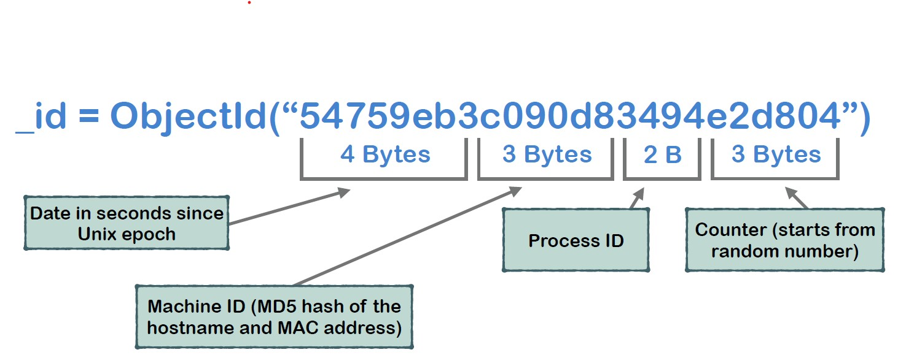

# Data Type:
|Type| Number ID| String ID|sample|
|  ----  | ----  |---- |----|
|String| 2 |“string”||
|Object| 3 |“object”||
|Array| 4 |“array”||
|Boolean| 8 |“bool”||
|32-bit Integer| 16 |“int”|10|
|64-bit Integer| 18 |“long”|NumberLong(123456)|
|Double| 1 |“double”|10.0|
|Date| 9 |“date”|ISODate("2008-01-01T07:33:33.123Z")|
|ObjectId| 7 |“objectId”|ObjectId("“54759eb3c090d83494e2d804”")|

## ObjectId
- Can not be duplicated within one collection
- Mandatory document field
- Can be assigned manually
- Will be created automatically if not assigned manually (recommended)

    _id = ObjectId(“54759eb3c090d83494e2d804”)





# basic CRUD Operations

## db
   created automatically when first collection creatation

    show dbs
    //drop database dbName
    use dbName
    db.dropDatabase()
  

## collections
    db.createCollection("first")
    db.getCollection("first").drop()
    db.first.drop()

 ### insert
   1. Insert One or Many Documents: WriteResult or BulkWriteResult
```
  
         db.<collection name>.insert(<Object> or <Array of Objects>)
```  

   2. Insert One Document:   insertedId
   ```
        db.<collection name>.insertOne(<Object> )
       
   ```
   3. Insert Many Documents: insertedIds
```
    db.<collection name>.insertMany(<Array of Objects>)
```

### find
1. Find Documents: Returns Cursor
```
db.<collection name>.find(<query>, <fields>) 

//Assign Cursor to the variable
var cursor = db.<collection name>.find(<args>);

//Iterate one document
cursor.next()

//Check if cursor has next document
cursor.hasNext()

//Quantity of documents left in current batch
cursor.objsLeftInBatch()

//Iterate all documents in the cursor and push them to the array
cursor.toArray()

// Iterate all documents in the cursor and perform operation with each of them
cursor.forEach(<function>)

//Count number of the documents in the cursor
cursor.count()

//Limit number of the documents in the cursor
cursor.limit(<number>)

// Skip certain number of the documents
cursor.skip(<number>)

// Sort documents in the cursor (1 asc， -1 desc)
cursor.sort({<fieldName1>: 1, <fieldName2>: -1, ...})

//execute order: sort->skip->limit

``` 

2. Find One Document: Returns Extended JSON Object
```
db.<collection name>.findOne(<query>, <fields>)
```

3. Query
- Equality Query
1. Match by exact value("***,***" is "***and***"): `{<fieldName1> : <value1>, <fieldName2> : <value2>, ...}`

-  Operators:
1. Operators add conditions: `{ <fieldName1>: { <operator1>: <value1> }, ... }`

    - $eq
    - $gt 
    - $lt
    - $ne 
    - $gte 
    - $lte
    - $in 
    - $nin

    - $and: 
    ***Explicit $and MUST be used if conditions contain same field or operator***
    - $or

```
{"favoriteFruit" : {"$ne": "apple"}}
{"age" : {"$gt": 25}}
{"eyeColor" : {"$in": ["green" , "blue"]}}
```

- Query Embedded Documents

```
{ "company.title": "SHEPARD" }
{ "company.location.address": "379 Tabor Court"}
```

- Query Array by element Value
    - Array contains certain value
    - Specific element in array has certain value
```
{ tags: "ad" }
{ "tags.0": "ad"}
{ "tags.3": "ab"}
```
- Query Array using $all , $size
```
{ tags: {"$all": ["ad" , "eu"]}}
{ tags: {"$size": 4}}
```
- Query Array of Nested Documents

```
//sample document:
{
    "name": "Mike",
    "friends": [
        {
        "name": "Lora",
        "age": NumberInt(23),
        registered: true
        },
        {
        "name": "Bob",
        "age": NumberInt(25),
         registered: false
        }
    ]
},
{
    "name": "Tom",
     "age": NumberInt(27)
}
```
```
{ "friends.name": "Lora" }
{ friends: {"name": "Lora", "age": 23} }

```

- $elemMatch 

```
{ friends: { $elemMatch: { name: "Bob", registered: false }}}
{ friends: { $elemMatch: { registered: false, age: 25 }}}

```
- $exists $type

```
{ tags: { $exists: true}}
{ name: { $exists: false}}
{ posts: { $type: "int"}}
{ name: { $type: 2}}
{ quantity: { $type: ["int" , "double"]}}
{ index: { $type: "int", $eq: 5}}
```

- Filter Fields or Projection (1-> include,  0 -> exclude)

```
db.persons.find({<query>} , {name: 1, age: 1})
db.persons.find({<query>} , {"company.location": 1, age: 1})
db.persons.find({<query>} , {_id: 0, name: 1, age: 1})
db.persons.find({<query>} , {name: 0, age: 0})
```

- $regex
```
{ city: {"$regex": /ton/i}}
{ tags: {"$regex": /^ad$/ , $options: "i"}}
{ state: {"$regex": "ca"}}
```

### update
`db.<collection>.method( <query>, <update>, <options> )`
    by default, only update the first matched document.
#### options:    
- multi: ture
- 
      


1. methods:
    - update
    - updateOne
    - updateMany
    - replaceOne

2. update operations:
    - $set 
    - $unset
    - $rename
    - $inc 
    - $mul
    - $pop 
    - $addToSet
    - $currentDate

#### Array Update Operators
- $ : Positional Op
- $push 
- $addToSet
- $pull 
- $pullAll 
- $pop

#### Other Ops
- $each: Modified op
- $inc: Increment op


### Delete
1. Docuemnt Delete
- remove(): 
```
//Removes All Documents that match query
 db.<collection>.remove(<query>)
 //Removes One Document that matches query
 db.<collection>.remove(<query>, true)
 ```
- deleteOne()
- deleteMany()
- drop(): delete collection `db.<collection>.drop()`

2. Database Delete
```
use <databaseName>
db.dropDatabase()
```

# Aggregation

## aggregate()
```
db.<collection>.aggregate([
<stage1>,
<stage2>,
...
<stageN>
])
```

## aggregation stages:
- $match:{\<query\>}
- $group 
- $project: include/exclude fields,  re-construt document.
- $sort 
- $count 
- $limit
- $skip 
- $out
- $unwind

```
db.persons.aggregate([
{ $unwind: "$tags"},
{ $project: {name: 1, gender: 1, tags: 1}}
])

```

## Accumulators
`{ $<accumulatorOperator>: <expression> }`
- $sum
- $avg
- $max
- $min

## Unary Operators
1. Unary Operators are usually used in the $project stage
2. In the $group stage Unary Operators can be used only in conjunction with Accumulators
- $type
- $or
- $lt 
- $gt
- $and 
- $multiply

## allowDiskUse: true
- All aggregation stages can use maximum 100 MB of RAM
-  Server will return error if RAM limit is exceeded
- Following option will enable MongoDB to write stages data to the temporal files { allowDiskUse: true }

`db.persons.aggregate([] , {allowDiskUse: true})`

# index (B-Tree)

- Indexes improve MongoDB query execution
- Without index whole collection must be scanned (COLLSCAN)
- Index stores sorted field values
- If appropriate index exists, MongoDB performs only index scan (IXSCAN)

1. default _id index: _id_
2. getIndexes(): `db.getCollection("persons").getIndexes()`
3. db.collection.createIndex( { <keyname>: [-1 | 1] }, <options> )

options:

    - { background: true }
    - { unique: true }
    - { name: "<indexName>" }
```
db.persons.createIndex( { age: 1 } )
db.persons.createIndex( { name: 1 } )

db.persons.createIndex(
    { index: 1 }, 
    { unique: true }
)
```
4. Returns information about the query
```
db.<collectionName>.explain().<method>
db.<collectionName>.explain("executionStats").<method>

db.persons.explain().find({"age": {$gt: 25}})
db.persons.explain().aggregate([{$group: {_id:"$country"}}])

```

5 delete index
```
// Deletes certain index
db.collection.dropIndex( { <fieldName>: 1 } )
db.collection.dropIndexes()
```