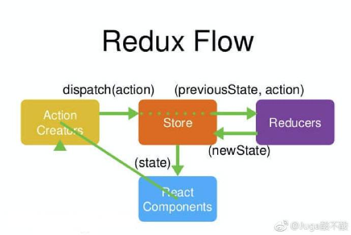

# Three Principles:
1. Single source of truth
2. State is read-only
3. Changes are made with pure functions

#  
1. store
```
     import {createStore} from 'redux'
     const store=createStore(fn);
```

2. state

     const state=store.getState()

3. Action
```
const action={
  type:'ADD_TODO',
  payload:'redux原理'
}
```

4. store.dispatch( )
```
store.dispatch({
  type:'ADD_TODO',
  payload:'redux原理'
})
```
5. Reducer: 必须是一个纯函数
```
const reducer =(state,action)=>{
  switch(action.type){
    case ADD_TODO:
        return newstate;
    default return state
  }
}
```  




# React Redux

1. connect()

- mapStateToProps()

    它是一个函数，建立一个从（外部的）state对象到（UI 组件的）props对象的映射关系。
mapStateToProps执行后应该返回一个对象，里面的每一个键值对就是一个映射。
 
- mapDispatchToProps()

   mapDispatchToProps是connect函数的第二个参数，用来建立 UI 组件的参数到store.dispatch方法的映射。它定义了哪些用户的操作应该当作 Action，传给 Store。它可以是一个函数，也可以是一个对象。是函数则会得到dispatch和ownProps（容器组件的props对象）两个参数

 


```
import { connect } from 'react-redux'

const mapStateToProps = (state) => {
  return {
    todos: getVisibleTodos(state.todos, state.visibilityFilter)
  }
}

const mapDispatchToProps = (
  dispatch,
  ownProps
) => {
  return {
    onClick: () => {
      dispatch({
        type: 'SET_VISIBILITY_FILTER',
        filter: ownProps.filter
      });
    }
  };
}

const VisibleTodoList = connect(
  mapStateToProps,
  mapDispatchToProps
)(TodoList)

```

2. Provider 组件
```
import { Provider } from 'react-redux'
import { createStore } from 'redux'
import todoApp from './reducers'
import App from './components/App'

let store = createStore(todoApp);

render(
  <Provider store={store}>
    <App />
  </Provider>,
  document.getElementById('root')
)
```

# Async

## redux-thunk

```
// redux-thunk example
import {applyMiddleware, createStore} from 'redux';
import axios from 'axios';
import thunk from 'redux-thunk';

const initialState = { fetching: false, fetched: false, users: [], error: null }
const reducer = (state = initialState, action) => {
    switch(action.type) {
        case 'FETCH_USERS_START': {
            return {...state, fetching: true} 
            break;
        }
        case 'FETCH_USERS_ERROR': {
            return {...state, fetching: false, error: action.payload} 
            break;
        }
        case 'RECEIVE_USERS': {
            return {...state, fetching: false, fetched: true, users: action.payload} 
            break;
        }
    }
    return state;
}
const middleware = applyMiddleware(thunk);

// store.dispatch({type: 'FOO'});
// redux-thunk 的作用即是将 action 从一个对象变成一个函数
store.dispatch((dispatch) => {
    dispatch({type: 'FETCH_USERS_START'});
    // do something async
    axios.get('http://rest.learncode.academy/api/wstern/users')
        .then((response) => {
            dispatch({type: 'RECEIVE_USERS', payload: response.data})
        })
        .catch((err) => {
            dispatch({type: 'FECTH_USERS_ERROR', payload: err})
        })
});
```

## Redux Saga
1. Helpers
 - takeEvery
 - takeLatest

2.  

es6 Generator
```
import { createStore, applyMiddleware } from 'redux'
import { Provider } from 'react-redux'
import createSagaMiddleware from 'redux-saga'
import rootSaga from './saga'

import App from './App'
import reducer from './reducers'

const sagaMiddleware = createSagaMiddleware()
// Store
const store = createStore(reducer,
  applyMiddleware(sagaMiddleware)
)
sagaMiddleware.run(rootSaga)
```
```

```


## Redux Promise